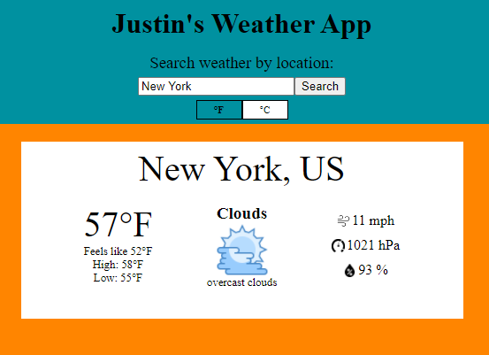

# WeatherApp
App that shows weather based on searched location.

Fetches weather from OpenWeatherMap API.

🔗 **Live preview** of the app is [here](https://j-haze.github.io/Weather/).

### Features: ###

* Search for the current weather in any city around the world
* Toggle between Celcius and Fehrenheit

### Built With: ###

* ReactJS
* JavaScript
* HTML/CSS
* [OpenWeatherMap](https://openweathermap.org/) API

### Picture: ###

